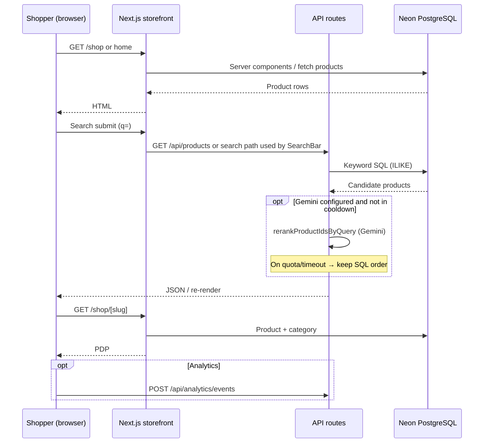
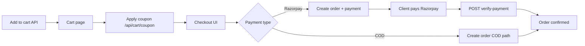
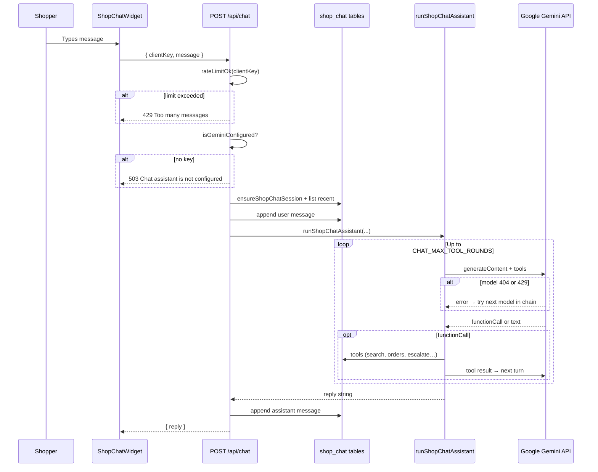

# End-to-end flows

**Purpose:** Sequence-level documentation of major journeys **as wired in code**, for onboarding, QA, and incident response.  
**Pair with:** [PRD](./PRD.md) · [Functional spec](./FUNCTIONAL-SPEC.md)

---

## Legend

- **Actor:** Guest, Customer, Admin, Packer, System (cron/webhook/job), External (Razorpay, Shiprocket, Resend, Google Gemini, OpenAI).
- **Solid lines** imply synchronous HTTP unless noted.

---

## 1. Shopper discovery → product detail

**Failure modes:** If Gemini rerank fails, listing order stays **SQL/keyword**. If `SEARCH_SEMANTIC_DISABLED=true`, rerank is skipped entirely.

---

## 2. Guest → account → merge wishlist

1. Guest browses with **local wishlist** (client storage — see wishlist components and merge API).
2. Guest starts **sign-in** (`/api/auth/*`): password, magic link, or Google.
3. On success, client may call **`POST /api/wishlist/merge`** to combine guest items into user wishlist.
4. Session now carries `user.id` for orders, chat tools, loyalty APIs.

---

## 3. Cart → coupon → checkout (high level)

**Loyalty / Karma:** Tier discounts and karma deduction behavior follow server rules described in `README.md` (COD vs prepaid timing).

---

## 4. Razorpay success path (conceptual)

1. Client completes Razorpay checkout widget / redirect per storefront implementation.
2. App calls **`POST /api/orders/verify-payment`** (or equivalent) with payment identifiers from Razorpay.
3. Handler validates signature/amount, updates **order status** and payment fields in DB.
4. **Inngest** may emit downstream events (order confirmation email, loyalty accrual, etc. — see `lib/inngest/emit-order-events.ts` and functions).

*Exact payload names: read `app/api/orders/verify-payment/route.ts`.*

---

## 5. Shiprocket webhook flow (conceptual)

1. Shiprocket sends HTTP webhook to **`/api/webhooks/shiprocket`**.
2. Handler validates and maps payload to internal order/shipment update.
3. Customer-facing **track** page may reflect new AWB/status when DB updated.

---

## 6. Shop chat (Gemini) end-to-end

**Rate limit / quota on Gemini:**

- Within one request: try **ordered model list** (working model first if set).
- If **all models** rate-limited: `geminiGenerateContent` may retry full chain with backoff when `retryOnceOnRateLimit` is true; final failure surfaces **`geminiQuotaUserMessage()`** as assistant text (still `200` with explanatory copy).

**Escalation path:** Model calls `escalate_to_human` → `insertShopChatEscalation` + **`sendEmail`** (Resend) when env configured.

---

## 7. Product search with semantic rerank

1. User submits query on shop search UI.
2. API loads **keyword candidate set** from DB (up to semantic rerank max slice, e.g. 72 ids in `semantic-rerank.ts`).
3. If Gemini not configured, disabled, in cooldown, or prompt empty → return **SQL order**.
4. Else build tab-separated candidate text → **`geminiGenerateContent`** (single pass, no chat-style multi-retry) → parse JSON list of ids.
5. On rate limit for all fallbacks → **arm cooldown** (`SEARCH_SEMANTIC_COOLDOWN_MS`) and return SQL order for subsequent searches until window passes.

**Important:** Chat’s `search_catalog` **skips** this rerank by design to save quota.

---

## 8. Personalization profile + “For you” rail

1. On relevant page load / trigger, server calls **`tryRefreshUserGeminiProfile(userId)`** if profile missing or stale (~7 days) and user has purchase or browse signals.
2. Prompt built from recent **order line product names** + **page view products** → Gemini JSON → persisted on `users`.
3. Home/shop may show **personalized picks**; if profile `summary` exists, **`enhancePersonalizedPicksWithGemini`** may call **`rerankProductIdsByQuery`** with a synthetic query including profile text → reorder cards; errors return original order.

---

## 9. Admin: fulfill order → packer

1. **Admin** opens `/admin/orders`, opens order detail.
2. Updates status, assigns AWB, or triggers **ship** actions per UI (`app/api/admin/orders/[id]/ship`, etc.).
3. **Packer** opens `/packer/picklist` (auth as packer or admin) to see consolidated pick work driven from admin picklist API.

---

## 10. Admin: AI product copy vs SEO description

| Flow | Endpoint | AI provider |
|------|----------|-------------|
| Short Gemini copy | `POST /api/admin/products/ai-copy` | Gemini (`generateProductCopyWithGemini`) |
| Long SEO HTML + meta JSON | `POST /api/admin/products/generate-description` | OpenAI `gpt-4o` |

Admin must be authenticated with **admin** role; failures return JSON errors (429 with quota message for Gemini path).

---

## 11. Referral capture

1. Visitor hits **`/r/{code}`** → response sets **referral cookie** (implementation in `app/r/[code]/route.ts`).
2. Later, authenticated user **`POST /api/referral/claim`** → DB links referrer, may tie into coupon programs (e.g. `WELCOME50` per seed docs).

---

## 12. Background jobs (Inngest)

Typical pattern:

1. App or webhook emits event / schedules function.
2. **Inngest** executes on schedule or event (Neon queries, Resend emails).
3. Examples: **loyalty-expire**, **campaign-heartbeat**, **low-stock-alert**, **order-status-changed**, **review-request**, **subscription-processor**.

*For exact triggers, read each file in `lib/inngest/functions/`.*

---

## 13. Health & smoke

- **`GET /api/health`** — deployment liveness.
- **`npm run smoke`** — scripted post-deploy checks (`scripts/smoke-test.ts`).

---

## 14. Flow maintenance checklist

When adding a feature, update:

1. This file — new sequence or swimlane.  
2. [FUNCTIONAL-SPEC.md](./FUNCTIONAL-SPEC.md) — inputs/outputs, env flags, error codes.  
3. [PRD](./PRD.md) — only if product scope or persona impact changes.  
4. `.env.example` — any new configuration.
